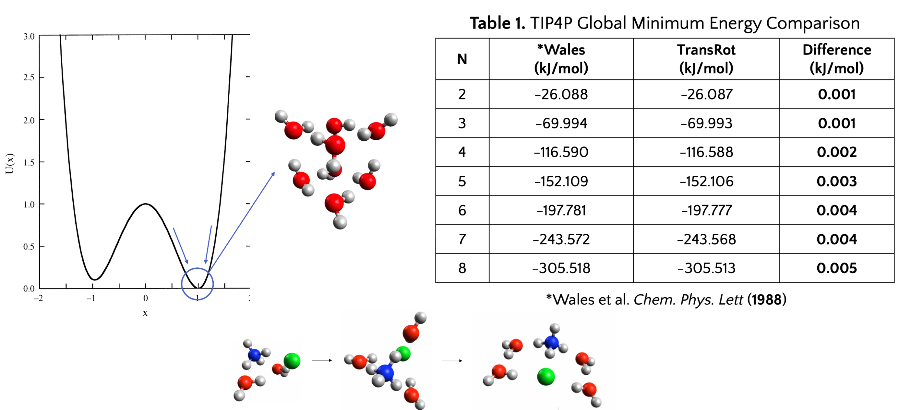
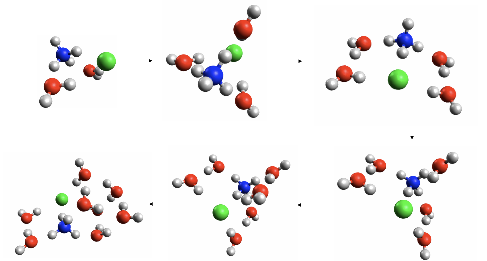
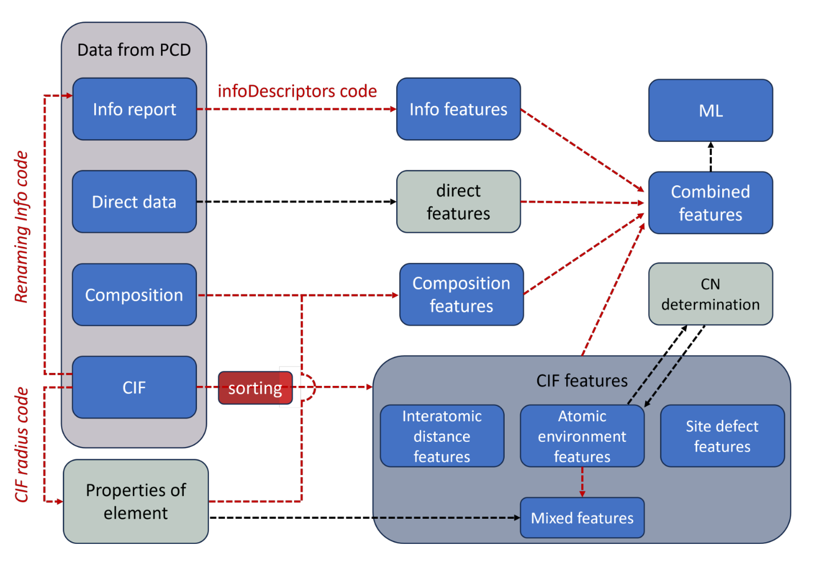
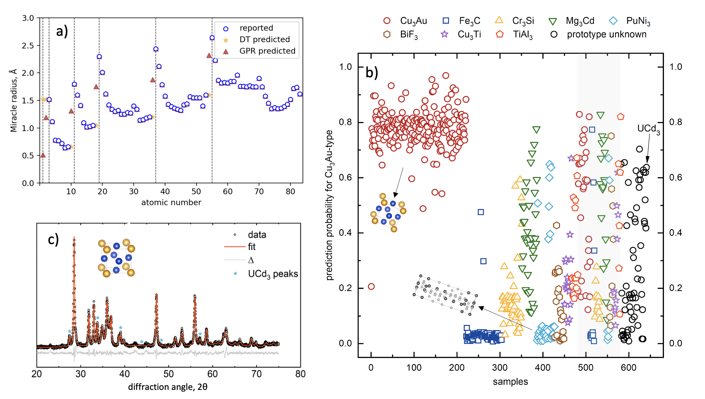

## I. First Principles & Computational Materials Science

### Quasiparticle phonons analysis
To be added

### TransRot: simulated annealing Monte Carlo geometry optimizer

[Book chapter](https://doi.org/10.1021/bk-2022-1428.ch002) |
[Poster](https://bobleesj.github.io/files/presentation/2022-MQM-poster.pdf) |
[GitHub](https://github.com/steventopper/TransRot)

Preliminary determination of the global minimum geometry of a nanocluster system through the use of an interaction force model prior to *ab initio* calculations is useful in the study of nanoparticles as well as in gas phase nano-solvation studies. To achieve this, our research group has developed a special purpose, open-source software package using our MW-SSA algorithm. TransRot is distributed through GitHub, is written in Java, is machine portable, and is actively supported and maintained. It can be natively installed in all major operating systems (Linux, macOS, and Windows) and is capable of parallel execution of multiple instances on a personal workstation. TransRot is numerically efficient and its behavior is easily controlled through edits to a single short, simple text file. The quasi-ergodicity issue of the original Metropolis-Hastings Monte Carlo algorithm is reduced with the incorporation of a move strategy with randomly magnified step-size and rotational movements (“mag-walking”), as well as a customizable simulated annealing schedule which enhances the probability of escape from local minima. The code’s ability to optimize small water clusters (2 to 8 molecules) described via the TIP3P, TIP4P, and TIP4P/2005 models are compared to the literature. Due to its machine portability, ease of use, and numerical efficiency, TransRot can be also used by an undergraduate or novice graduate student for computational chemistry research and educational purposes.

`geometry optimizer`, `Monte Carlo`, `ab initio`, `TIP4P`

 

## II. Data-driven Methods in Materials Science

### High-throughput geometric crystal featurizer for binary and ternary compounds

[GitHub](https://github.com/bobleesj/cif-cn-featurizer) | [Journal of Alloys and Compounds](https://doi.org/10.1016/j.jallcom.2023.173241)

Traditional machine learning models in solid-state materials have predominantly relied on composition data to predict properties. The lack of structural information often leads to incomplete property mapping and predictive noise. The  open-source Python tool was built crafted for the high-throughput extraction of crystal structure features. This geometric featurizer  processes raw Crystallographic Information Files (CIF) to construct supercells and meticulously extracts a comprehensive suite of descriptors, such as coordination numbers, interatomic distances, and atomic environments. These descriptors are not mere extrapolations from generic values but are tailored to the material's specific structure, reducing noise and enhancing the relevance of ML applications for binary and ternary compounds. The package has demonstrated its robustness, having processed more than 10,000 binary and ternary CIF files. Leveraging structure-property correlations, we believe this crystal structure featurizer can be a promising tool for increasing predictive capabilities for material property optimization in machine learning application.

`geometric descriptors`,  `crystal structure`, `feature engineering`, `machine learning`

 

### Composition-derived features for crystal structure prediction

[ChemRxiv](https://doi.org/10.26434/chemrxiv-2023-0nlzl) |
[Download CSV](https://data.mendeley.com/datasets/bt6gv5z6yv/2)

This project addresses the challenge of mapping material compositions to corresponding properties, such as crystal structures. A critical aspect of this research involves effectively linking elemental data with compound properties and overcoming obstacles presented by incomplete raw elemental data from literature. At the heart of our methodology is the Oliynyk property list, which incorporates 98 unique properties for each element. This exhaustive list has proved vital in facilitating more than 20 studies that have undergone experimental validation. A pivotal element of our approach is the innovative application of Gaussian process regression, which was specifically utilized to tackle the issue of missing values in the elemental property list. This strategic implementation is essential as it enables the use of analytical methods such as Support Vector Machine (SVM) algorithms, which depend on a fully populated x-block devoid of any data voids. My research endeavor involved identifying the most efficacious machine learning model to predict missing entries in the compositional features of electronegativity and radii, following a thorough literature review. I conducted extensive trials with various ML models. Ultimately, Gaussian process regression was identified as the optimal solution. This method excelled at interpolating complex datasets, including the interpolation of 26 radii over five scales and 17 electronegativities over three scales. Our approach demonstrates that it is possible to aid the prediction of an unknown materials properties through compositional elemental properties aided with ML-driven interpolation. The successful synthesis and subsequent validation of a new intermetallic compound, UCd3, via x-ray powder diffraction, is a testament to the tangible outcomes. 

`materials infomatics`, `feature engineering`, `Gaussian process regression (GPR)`. `interpolation`
